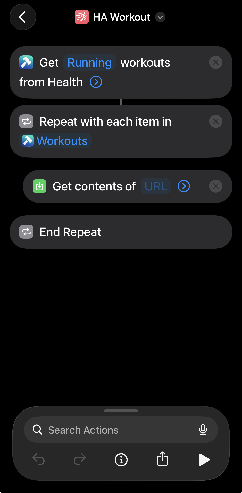
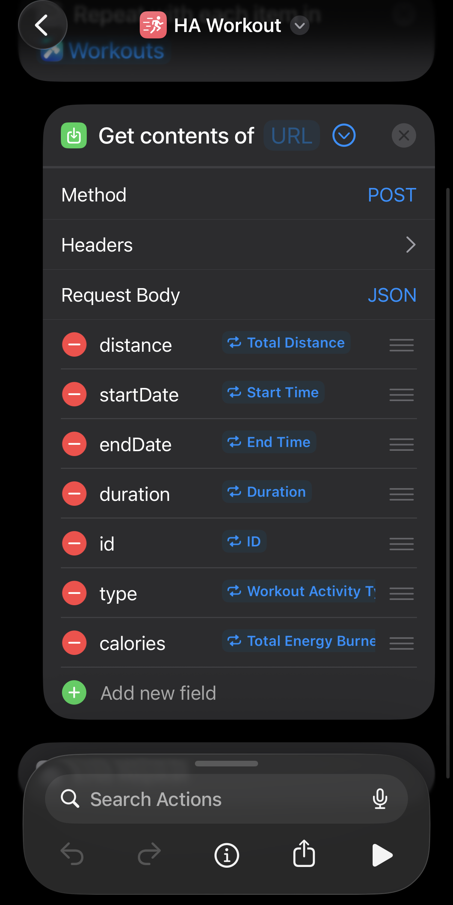

# HA Workouts

A Home Assistant custom integration (HACS) that pulls workout and daily health
data from Garmin, Strava, and/or Apple Health and exposes it as sensors, with
long-term statistics for charting aggregated activity over time — monthly
running distance, year-to-date totals, year-over-year comparisons, and so on.

You can add Garmin, Strava, Apple Health, or any combination — each is a
separate config entry with its own source-prefixed sensors
(`sensor.garmin_*`, `sensor.strava_*`, `sensor.apple_health_*`), so data from
each source can be charted separately or side by side.

## Supported sources

- **Garmin Connect** — email/password login (unofficial API, no developer
  account required).
- **Strava** — OAuth2, using your own Strava API application (see [Strava
  setup](#strava-setup) below). **As of Strava's June 2026 developer program
  change, this requires an active paid Strava subscription ($11.99/mo) on the
  account that owns the API application** — this is Strava's policy, not
  something this integration can work around. Without a subscription, Strava
  marks the application "Inactive" and rejects requests with a 403 error even
  after a successful sign-in.
- **Apple Health** — via a webhook pushed from an iOS Shortcut (see
  [Apple Health setup](#apple-health-setup) below). Apple doesn't offer a
  cloud API for Health data, so this works by receiving workouts from your
  phone rather than pulling them. There's no depth setting to choose like
  Garmin/Strava's backfill — instead, the Shortcut's "Get Workouts" action
  returns your full on-device workout history the first time it runs, so
  your existing history arrives all at once as soon as you run it.
- Google Fit / Fitbit — not yet supported.

## Installation

1. In HACS, add this repository as a custom repository (category:
   Integration), then install "HA Workouts".
2. Restart Home Assistant.
3. Go to **Settings → Devices & Services → Add Integration**, search for
   "HA Workouts".
4. Choose a source (Garmin, Strava, or Apple Health) and follow the prompts —
   see [Garmin setup](#garmin-setup) / [Strava setup](#strava-setup) /
   [Apple Health setup](#apple-health-setup) below.
5. For Garmin and Strava: choose how far back to import history. This
   backfill runs in the background after setup finishes — for several years
   of history it can take several minutes (see
   [History backfill](#history-backfill) below) — and can be extended later
   without redoing it via the integration's **Configure** option. (Apple
   Health has no depth to choose — see
   [Apple Health setup](#apple-health-setup) below for how its history
   arrives instead.)
6. To add another source, repeat from step 3 (e.g. add Garmin, then run
   setup again and add Strava and/or Apple Health).

### Garmin setup

Just enter your Garmin Connect email and password — no developer account or
API key needed. This uses the unofficial `garminconnect` library to sign in
the same way the Garmin Connect app does.

Garmin's API is unofficial and undocumented, so this integration is
deliberately conservative about request pacing to avoid tripping its rate
limits (see [Rate limits](#rate-limits--why-things-might-be-slow) below).

### Strava setup

Strava requires you to register your own API application — this integration
never uses a shared/bundled key:

1. Go to [strava.com/settings/api](https://www.strava.com/settings/api) and
   create an API application.
2. Set **Authorization Callback Domain** to your Home Assistant's domain
   (e.g. `homeassistant.local` or your external hostname — no `https://` and
   no path).
3. Copy the **Client ID** and **Client Secret** shown on that page.
4. In Home Assistant, go to **Settings → Devices & Services → Application
   Credentials**, add an entry for `ha_workouts`, and paste in the Client ID
   and Secret.
5. **Make sure the Strava account that owns this API application has an
   active Strava subscription.** Otherwise the app shows as "Inactive" and
   the integration fails to connect with a 403 error immediately after you
   authorize — this is the single most common setup failure, see
   [Troubleshooting](#troubleshooting).
6. Continue the HA Workouts config flow — you'll be redirected to Strava to
   authorize access, then back here to finish setup.

### Apple Health setup

Apple Health/HealthKit has no cloud API, so there's nothing to poll — instead,
the integration generates a webhook URL during setup, and an iOS Shortcut on
your phone pushes each workout to it.

1. Start the config flow and choose **Apple Health**. HA Workouts generates a
   webhook URL and shows it to you — copy it (you can view it again later from
   the integration's **Configure** option if you need it, e.g. for a second
   phone).
2. Install [Toolbox Pro](https://apps.apple.com/app/id1476205977) on your
   iPhone. Stock Shortcuts can only read raw daily quantity totals (e.g.
   "Walking + Running Distance"), which lump incidental walking in with real
   workouts and carry no per-session date — Toolbox Pro's **Get Workouts**
   action is what gets real structured workout records (type, distance,
   duration, calories) out of HealthKit.
3. Get the Shortcut itself — two options:
   - **Use the pre-built Shortcut (easiest):** open
     [this share link](https://www.icloud.com/shortcuts/afe46d04f4ce464c8ed76937cd865229)
     on your iPhone and tap **Add Shortcut**. The first time it runs, it'll
     ask you to paste in a webhook URL — paste the one from step 1. Skip to
     step 4.
   - **Or build it yourself:** create a new Shortcut with:
     - **Get Workouts** (from Toolbox Pro) to fetch your workout history.
     - For each result, build a dictionary with keys (all set to `Text`):
       - `id` — the workout's unique identifier (used to avoid
         double-counting if the Shortcut runs again over the same workout)
       - `type` — e.g. `Running`, `Cycling`, `Walking`, `Swimming`, `Hiking`
       - `startDate` / `endDate`
       - `duration` — in minutes
       - `distance` — with unit, e.g. `11.4 km` (also accepts `mi`)
       - `calories` — with unit, e.g. `724 kcal`
     - **Get Contents of URL**: method `POST`, URL = the webhook URL from
       step 1, request body = that dictionary, encoded as JSON.
4. Set the Shortcut to run automatically without confirmation prompts — e.g.
   a Shortcuts **Automation** (time of day, or "when app closes" for a
   fitness app) with **Ask Before Running** turned off, so it can post in the
   background.
5. Finish the config flow. The first time the Shortcut runs, matching
   per-activity-type sensors (e.g. `sensor.apple_health_running_distance_km`)
   appear and start reporting. Since Toolbox Pro's **Get Workouts** returns
   your full on-device workout history (not just new workouts), the first run
   typically posts your whole existing history in one go — there's no
   separate backfill step to configure like Garmin/Strava.
6. Optional - Create an automation to run every `x` days to run the shortcut to keep your data updated. Alternatively, create an automation to run the shortcut whenever you complete a workout.

Get the workouts


Setting up the data (make sure all fields are `Text`)


## Data exposed

- **Daily summary sensors** (Garmin only — Strava and Apple Health have no
  equivalent): steps, resting heart rate, active calories, floors climbed,
  average stress, body battery.
- **Per-activity-type sensors**, source-prefixed, e.g.
  `sensor.garmin_running_distance_km`, `sensor.strava_cycling_duration_minutes`,
  `sensor.apple_health_running_distance_km`: a lifetime-cumulative running
  total (like an odometer, not "today's total") for distance/duration/calories
  per activity type. Charting day/week/month/year totals from this is what
  the examples below show — the cumulative value itself isn't meant to be
  read directly.
- **Last activity**: name, type, duration of your most recent workout.
- **History import status** (`..._history_import_status`, Garmin/Strava
  only): shows backfill progress (`idle` / `running` / `backing_off` /
  `complete` / `error`) and how far back it's reached — useful to watch
  during a large first-time import. See
  [History backfill](#history-backfill). Apple Health doesn't have this
  sensor — its history arrives directly via the Shortcut rather than a
  paced background job, so there's no progress to report.

## Charting your data

All charting below uses Home Assistant's built-in **Statistics Graph** and
**Statistics** cards — no custom card or YAML template required.

### Monthly running distance (bar chart)

1. Edit a dashboard → **+ Add Card** → search **"Statistics Graph"**.
2. Set:
   - **Entities**: `sensor.garmin_running_distance_km`
   - **Period**: Month
   - **Stat type**: Change
   - **Graph type**: Bar
3. Save.

"Change" is what turns the cumulative sensor into a per-period bar chart —
it's the difference between consecutive period boundaries, not the raw
running total. This also works with `_duration_minutes` or `_calories`, and
with `Period: Day` or `Period: Week` for finer granularity.

### Running distance, year to date

1. Edit a dashboard → **+ Add Card** → search **"Statistics"** (the
   single-value stat card, not "Statistics Graph").
2. Set:
   - **Entity**: `sensor.garmin_running_distance_km`
   - **Period**: Year
   - **Stat type**: Change
3. Save. This shows how far you've run since Jan 1 of the current year,
   updating live as new activities come in.

### Comparing two sources, or two activity types

Add multiple entities to one Statistics Graph card — e.g.
`sensor.garmin_running_distance_km` and `sensor.apple_health_running_distance_km`
(if you use both), or `sensor.garmin_running_distance_km` and
`sensor.garmin_cycling_distance_km` — to overlay them on the same chart.

### Comparing this year to last year

Home Assistant's Statistics Graph card doesn't natively overlay two
different year ranges on one chart. The simplest working approach: add two
Statistics Graph cards to the same dashboard view, one showing `Period:
Month` for the current year and one for the previous year (use the card's
date-range picker to pin each to its respective year), stacked so you can
compare them side by side.

## History backfill

Applies to Garmin and Strava only. Apple Health's existing history arrives a
different way — via the Shortcut's first run, which returns your full
on-device workout history in one batch (see
[Apple Health setup](#apple-health-setup)) — rather than this paced,
gap-aware background job.

On first setup (and whenever you increase the configured depth via
**Configure**), the integration fetches your past activity history and
imports it into Home Assistant's long-term statistics — this is what makes
the charts above useful immediately instead of starting from an empty graph.

- Depth options range from 90 days to "all available history." Longer
  ranges mean more API requests to your source, paced conservatively (see
  below), so a multi-year backfill can take several minutes.
- Progress is visible on the `..._history_import_status` sensor.
- It's gap-aware and self-healing: if Home Assistant restarts mid-backfill,
  the next run detects any incomplete range and re-fetches it rather than
  leaving a permanent hole in your history.
- Increasing the depth later only fetches the newly-uncovered older days —
  it doesn't redo the whole import.

## Rate limits / why things might be slow

Garmin's API is unofficial and undocumented, so this integration paces
backfill requests conservatively (20s between request batches, plus a
cooldown after login) to avoid triggering Garmin's rate limiting — which,
if hit, can lock out _all_ API access for that account for an extended
period, not just the backfill. Strava's documented limits are more generous
so its pacing is lighter. If you see the history import sensor show
`backing_off`, this is expected behavior after a rate limit, not an error —
it will retry automatically.

## Troubleshooting

**Strava: "Strava rejected the request with a 403... status Inactive"** — the
Strava account that owns your API application doesn't have an active paid
Strava subscription. Subscribe on that account, reactivate the app at
strava.com/settings/api, then retry setup. See [Strava
setup](#strava-setup) above.

**Garmin: repeated "429 Too Many Requests" / integration stuck retrying** —
Garmin has rate-limited the account, usually from many rapid sign-in
attempts (e.g. repeatedly restarting Home Assistant in a short window).
Home Assistant retries automatically with increasing backoff; avoid
restarting Home Assistant repeatedly while this is happening, as each
restart re-triggers a fresh sign-in and can extend the lockout. It
typically clears within 30–60 minutes of being left alone.

**A Statistics Graph card shows a big spike or drop on one day** — this
generally means the underlying statistics history has a gap or was
imported before a fix to this integration. For Garmin/Strava, increasing
then re-saving the backfill depth in **Configure** triggers a fresh,
self-healing import (see [History backfill](#history-backfill)). For Apple
Health, which doesn't have a backfill setting to re-trigger, re-run the
Shortcut to resend the affected workouts instead.

**Apple Health: the Shortcut runs but no data shows up** — first confirm the
webhook URL is actually reachable from your phone: open it directly in
Safari on the phone (not just in a browser on the same computer running HA).
A working webhook returns a plain-text `OK` or `Ignored (duplicate)` — Safari
may show this as a zero-byte "download," which is expected and means the
request succeeded, not a failure. If the URL doesn't load at all, check
**Settings → System → Network → Internal URL** in Home Assistant is set to
an address your phone can actually reach (e.g. your HA instance's LAN IP,
not `localhost`), and regenerate the Shortcut's URL from **Configure** on the
Apple Health integration entry afterwards.

**Apple Health: workouts appear twice, or a huge batch of history lands at
once** — the first time you run a "Get Workouts"-based Shortcut, Toolbox Pro
returns your _entire_ on-device workout history, not just new workouts, so
expect a large batch to post all at once on the first run. Re-running the
same Shortcut later is safe: each workout carries a stable `id`, and this
integration ignores anything it's already seen since the last Home Assistant
restart.

## Development

This repo includes a `docker-compose.dev.yml` for running a local Home
Assistant instance with the integration bind-mounted, so code changes are
picked up on restart without reinstalling anything:

```bash
docker compose -f docker-compose.dev.yml up -d
# HA available at http://localhost:8123
```

```bash
pip install -r requirements-dev.txt
ruff check custom_components/ha_workouts
```

### Architecture

- `models.py` — source-agnostic data model (`Activity`, `DailySummary`, `BodyComposition`)
- `sources/base.py` — `WorkoutSource` interface each provider implements
- `sources/garmin.py` — Garmin Connect implementation (unofficial API)
- `sources/strava.py` — Strava implementation (OAuth2 via Application Credentials)
- `sources/apple_health.py` — Apple Health implementation; a push receiver
  rather than a poller, parses webhook payloads from an iOS Shortcut into
  `Activity` objects and queues them for the coordinator
- `application_credentials.py` — declares Strava's OAuth2 endpoints
- `coordinator.py` — polling `DataUpdateCoordinator`, fetches today's data
  (or, for Apple Health, drains whatever's arrived via webhook since the
  last poll)
- `statistics_import.py` — gap-aware historical backfill into HA's long-term
  statistics tables for Garmin/Strava, plus `async_apply_activity_deltas`,
  which folds newly-seen activities into the same statistics tables keyed by
  each activity's own real date — used for every live update, and the only
  path Apple Health ever writes through, since it has no separate backfill
- `config_flow.py` — source picker, Garmin form, Strava OAuth2 flow, Apple
  Health webhook generation, backfill depth selection for Garmin/Strava
  (initial + reconfigurable via Options)
- `__init__.py` — registers the Apple Health webhook endpoint and its
  request handler, alongside general entry setup/teardown
- `sensor.py` — daily summary, per-activity-type, and backfill status entities

Adding a new source means implementing `WorkoutSource` in `sources/` and
wiring it into `config_flow.py` and `__init__.py`'s `_build_source`.
